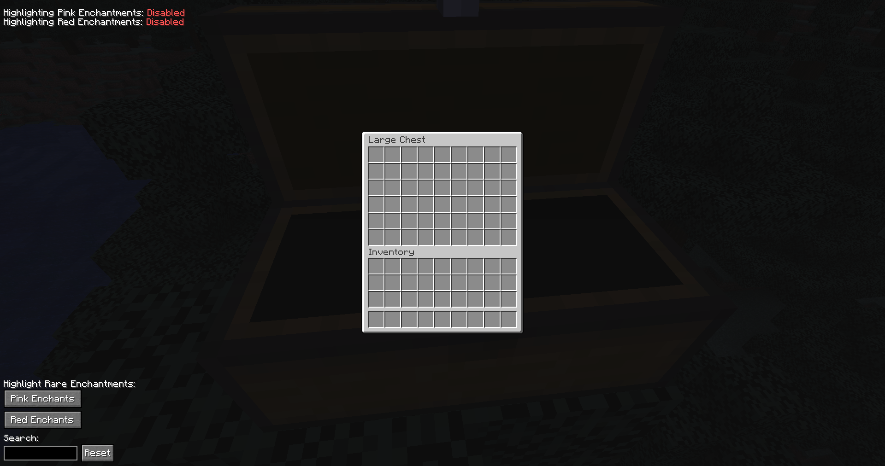

# EnchantingGoBrrrr

**EnchantingGoBrrrr** is a client-side Minecraft mod that enhances the inventory GUI by letting you search for items and highlight enchantments directly inside various container screens.

---

## Features

- **Search Bar**  
  Type any keyword to highlight items in inventories, chests, anvils, shulkers, and enchanting tables by:
    - Item name
    - Tooltip/lore text

-  **Enchantment Highlighting** (Animesucht.com only)
    - Toggle **Red Enchantment** highlighting
    - Toggle **Pink Enchantment** highlighting
    - Fully customizable highlight colors

- **Configurable UI**
    - Open a settings screen in-game with `Right Shift`
    - Toggle individual container support
    - Adjust highlight and search colors with built-in color pickers

---

## Color Customization

Change the following highlight colors in the settings UI:

- Pink Enchantments (Animesucht.com only)
- Red Enchantments (Animesucht.com only)
- Search Matches
- No Search Matches
- UI Color Theme

---

## 📸 Screenshots

> 

> 

> 
